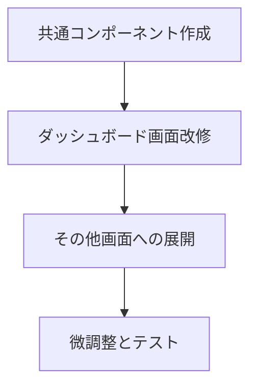

# UI デザイン改善 実装計画書

## 1. 実装概要

本実装計画では、要件と設計に基づいてUIデザインの改善を段階的に実装します。既存の機能を維持しながら、視覚的に魅力的なインターフェースへと改善していきます。

## 2. 実装フェーズ

### フェーズ1: 共通コンポーネントの作成（推定時間: 30分）

#### 1.1 ディレクトリ構造の準備
```
app/components/
├── ui/
│   ├── GradientLayout.tsx
│   ├── DashboardCard.tsx
│   ├── PrimaryButton.tsx
│   ├── SecondaryButton.tsx
│   ├── IconButton.tsx
│   └── LoadingSpinner.tsx
```

#### 1.2 実装するコンポーネント
1. **GradientLayout.tsx**
   - グラデーション背景のレイアウトコンポーネント
   - 全画面表示対応
   - 子要素の配置調整

2. **DashboardCard.tsx**
   - 半透明白背景のカードコンポーネント
   - シャドウとホバーエフェクト
   - レスポンシブ対応

3. **ボタンコンポーネント群**
   - PrimaryButton: グラデーション背景
   - SecondaryButton: 白背景
   - IconButton: アイコン付き

4. **LoadingSpinner.tsx**
   - アニメーション付きローディング表示

### フェーズ2: ダッシュボード画面の改修（推定時間: 45分）

#### 2.1 実装タスク
1. **レイアウトの変更**
   - GradientLayoutコンポーネントの適用
   - ヘッダーセクションの再構築

2. **クイックアクションセクション**
   - 既存のリンクをカード形式に変更
   - アイコンの追加（絵文字使用）
   - グラデーション背景の適用

3. **プレイリストセクション**
   - DashboardCardでラップ
   - グリッドレイアウトの改善
   - 空状態のデザイン改善

4. **ヘッダーの改善**
   - ロゴ/ブランド表示の追加
   - ユーザー情報の表示
   - ログアウトボタンのスタイル改善

### フェーズ3: その他の画面への展開（推定時間: 30分）

#### 3.1 対象画面
1. **プレイリスト作成画面** (`/playlist/create`)
2. **プレイリスト詳細画面** (`/playlist/[id]`)
3. **クイズ作成画面** (`/quiz/create`)
4. **クイズ参加画面** (`/quiz/join`)

#### 3.2 実装内容
- GradientLayoutの適用
- フォームのスタイル改善
- ボタンコンポーネントの置き換え

### フェーズ4: 微調整とテスト（推定時間: 15分）

#### 4.1 確認項目
1. **レスポンシブデザイン**
   - モバイル表示の確認
   - タブレット表示の確認
   - デスクトップ表示の確認

2. **機能テスト**
   - 既存機能が正常に動作すること
   - リンクとナビゲーションの確認

3. **パフォーマンス**
   - ページ読み込み速度
   - アニメーションの滑らかさ

## 3. 実装順序と依存関係



## 4. 技術的な実装詳細

### 4.1 Tailwind CSS クラスの活用
- 既存のTailwind設定を最大限活用
- カスタムCSSは最小限に抑える
- レスポンシブクラスの適切な使用

### 4.2 コンポーネントの再利用性
- props による柔軟なカスタマイズ
- デフォルト値の適切な設定
- TypeScriptによる型安全性の確保

### 4.3 既存コードへの影響
- 既存の機能を破壊しない
- 段階的な置き換え
- 後方互換性の維持

## 5. リスクと対策

### 5.1 想定されるリスク
1. **既存機能の破損**
   - 対策: 各フェーズ後の動作確認

2. **パフォーマンスの低下**
   - 対策: 軽量なCSSアニメーションの使用

3. **レスポンシブ対応の不備**
   - 対策: 各ブレークポイントでの確認

### 5.2 ロールバック計画
- Gitによるバージョン管理
- 各フェーズ完了時のコミット
- 問題発生時の即座のロールバック

## 6. 成果物

### 6.1 新規作成ファイル
- `/app/components/ui/` 配下の共通コンポーネント群

### 6.2 更新ファイル
- `/app/dashboard/page.tsx`
- その他の主要画面ファイル

### 6.3 ドキュメント
- 実装完了後のコンポーネント使用ガイド（必要に応じて）

## 7. 実装スケジュール

総実装時間: 約2時間

1. フェーズ1: 30分
2. フェーズ2: 45分
3. フェーズ3: 30分
4. フェーズ4: 15分

## 8. 実装チェックリスト

- [ ] 共通コンポーネントの作成
  - [ ] GradientLayout
  - [ ] DashboardCard
  - [ ] ボタンコンポーネント群
  - [ ] LoadingSpinner
- [ ] ダッシュボード画面の改修
  - [ ] レイアウト変更
  - [ ] クイックアクション
  - [ ] プレイリストセクション
- [ ] その他画面への展開
- [ ] テストと微調整
- [ ] 最終確認