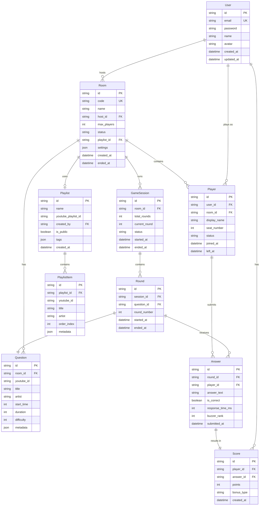

# データベース設計書

## 1. 概要

YouTube イントロクイズバトルシステムのデータベース設計について、RDB（PostgreSQL）とNoSQL（Redis）の設計詳細を定義します。

## 2. データベースアーキテクチャ

### 2.1 データストア構成

```
┌──────────────────────────────────────────┐
│           Application Layer              │
├──────────────────────────────────────────┤
│           Prisma ORM                     │
├──────────────┬───────────────────────────┤
│  PostgreSQL  │        Redis              │
│  (永続化)     │   (キャッシュ/Pub-Sub)     │
│              │                           │
│  - Users     │   - Sessions              │
│  - Rooms     │   - Game State            │
│  - Questions │   - Buzzer Queue          │
│  - Scores    │   - Leaderboard           │
└──────────────┴───────────────────────────┘
```

### 2.2 データ分類

| データ種別 | 格納先 | 理由 |
|-----------|--------|------|
| ユーザー情報 | PostgreSQL | 永続性、ACID特性が必要 |
| ルーム情報 | PostgreSQL | 永続性、関連データとの整合性 |
| クイズデータ | PostgreSQL | 永続性、検索性能 |
| スコア履歴 | PostgreSQL | 永続性、集計処理 |
| セッション情報 | Redis | 一時的、高速アクセス |
| ゲーム状態 | Redis | リアルタイム性、一時的 |
| 早押しキュー | Redis | アトミック操作、順序保証 |
| リーダーボード | Redis | 高速ランキング処理 |

## 3. PostgreSQL スキーマ設計

### 3.1 ER図



### 3.2 テーブル定義詳細

#### users テーブル
```sql
CREATE TABLE users (
    id VARCHAR(30) PRIMARY KEY DEFAULT gen_random_uuid(),
    email VARCHAR(255) UNIQUE NOT NULL,
    password VARCHAR(255) NOT NULL,
    name VARCHAR(100) NOT NULL,
    avatar VARCHAR(500),
    oauth_provider VARCHAR(50),
    oauth_id VARCHAR(255),
    email_verified BOOLEAN DEFAULT FALSE,
    created_at TIMESTAMP DEFAULT CURRENT_TIMESTAMP,
    updated_at TIMESTAMP DEFAULT CURRENT_TIMESTAMP,
    
    INDEX idx_users_email (email),
    INDEX idx_users_oauth (oauth_provider, oauth_id)
);
```

#### rooms テーブル
```sql
CREATE TABLE rooms (
    id VARCHAR(30) PRIMARY KEY DEFAULT gen_random_uuid(),
    code VARCHAR(6) UNIQUE NOT NULL,
    name VARCHAR(100) NOT NULL,
    host_id VARCHAR(30) NOT NULL REFERENCES users(id),
    max_players INT DEFAULT 20,
    status VARCHAR(20) DEFAULT 'WAITING',
    playlist_id VARCHAR(30) REFERENCES playlists(id),
    settings JSONB DEFAULT '{}',
    created_at TIMESTAMP DEFAULT CURRENT_TIMESTAMP,
    ended_at TIMESTAMP,
    
    INDEX idx_rooms_code (code),
    INDEX idx_rooms_status (status),
    INDEX idx_rooms_host (host_id),
    CHECK (max_players > 0 AND max_players <= 100)
);
```

#### players テーブル
```sql
CREATE TABLE players (
    id VARCHAR(30) PRIMARY KEY DEFAULT gen_random_uuid(),
    user_id VARCHAR(30) REFERENCES users(id),
    room_id VARCHAR(30) NOT NULL REFERENCES rooms(id),
    display_name VARCHAR(50) NOT NULL,
    seat_number INT,
    status VARCHAR(20) DEFAULT 'ACTIVE',
    joined_at TIMESTAMP DEFAULT CURRENT_TIMESTAMP,
    left_at TIMESTAMP,
    
    INDEX idx_players_room (room_id),
    INDEX idx_players_user (user_id),
    UNIQUE KEY uk_room_seat (room_id, seat_number),
    UNIQUE KEY uk_room_user (room_id, user_id)
);
```

#### questions テーブル
```sql
CREATE TABLE questions (
    id VARCHAR(30) PRIMARY KEY DEFAULT gen_random_uuid(),
    room_id VARCHAR(30) NOT NULL REFERENCES rooms(id),
    youtube_id VARCHAR(50) NOT NULL,
    title VARCHAR(500) NOT NULL,
    artist VARCHAR(255),
    start_time INT DEFAULT 0,
    duration INT DEFAULT 15,
    difficulty INT DEFAULT 1,
    metadata JSONB DEFAULT '{}',
    
    INDEX idx_questions_room (room_id),
    INDEX idx_questions_youtube (youtube_id),
    CHECK (difficulty >= 1 AND difficulty <= 5),
    CHECK (duration > 0 AND duration <= 60)
);
```

#### answers テーブル
```sql
CREATE TABLE answers (
    id VARCHAR(30) PRIMARY KEY DEFAULT gen_random_uuid(),
    round_id VARCHAR(30) NOT NULL REFERENCES rounds(id),
    player_id VARCHAR(30) NOT NULL REFERENCES players(id),
    answer_text VARCHAR(500),
    is_correct BOOLEAN DEFAULT FALSE,
    response_time_ms INT NOT NULL,
    buzzer_rank INT,
    submitted_at TIMESTAMP DEFAULT CURRENT_TIMESTAMP,
    
    INDEX idx_answers_round (round_id),
    INDEX idx_answers_player (player_id),
    INDEX idx_answers_correct (is_correct),
    UNIQUE KEY uk_round_player (round_id, player_id)
);
```

#### scores テーブル
```sql
CREATE TABLE scores (
    id VARCHAR(30) PRIMARY KEY DEFAULT gen_random_uuid(),
    player_id VARCHAR(30) NOT NULL REFERENCES players(id),
    answer_id VARCHAR(30) REFERENCES answers(id),
    points INT NOT NULL,
    bonus_type VARCHAR(50),
    created_at TIMESTAMP DEFAULT CURRENT_TIMESTAMP,
    
    INDEX idx_scores_player (player_id),
    INDEX idx_scores_answer (answer_id)
);
```

### 3.3 インデックス戦略

#### パフォーマンス最適化インデックス
```sql
-- 頻繁に使用されるクエリ用の複合インデックス
CREATE INDEX idx_rooms_active ON rooms(status, created_at DESC) 
WHERE status IN ('WAITING', 'IN_PROGRESS');

CREATE INDEX idx_players_active ON players(room_id, status) 
WHERE status = 'ACTIVE';

CREATE INDEX idx_scores_leaderboard ON scores(player_id, points DESC);

-- 部分インデックス（アクティブなデータのみ）
CREATE INDEX idx_rooms_recent ON rooms(created_at DESC) 
WHERE created_at > CURRENT_DATE - INTERVAL '7 days';
```

## 4. Redis データ構造設計

### 4.1 キー設計規則

```
{prefix}:{entity}:{id}:{field}

例：
- session:room:abc123:state
- cache:user:user123:profile
- buzzer:room:abc123:question:q456
- leaderboard:global:daily:20240315
```

### 4.2 データ構造詳細

#### セッション管理
```redis
# ルームセッション
HSET session:room:{roomId} 
    host_id {userId}
    status "IN_PROGRESS"
    current_question {questionId}
    current_round 3
    total_rounds 10
    started_at {timestamp}

# プレイヤーセッション
HSET session:player:{playerId}
    room_id {roomId}
    user_id {userId}
    socket_id {socketId}
    status "ACTIVE"
    score 150
```

#### 早押しキュー
```redis
# 早押し順位管理（Sorted Set）
ZADD buzzer:room:{roomId}:question:{questionId}
    {timestamp1} {playerId1}
    {timestamp2} {playerId2}
    {timestamp3} {playerId3}

# 早押しロック（アトミック操作）
SET buzzer:lock:{roomId}:{questionId} {playerId} NX EX 30
```

#### リアルタイムリーダーボード
```redis
# ルーム内ランキング
ZADD leaderboard:room:{roomId}
    150 {playerId1}
    120 {playerId2}
    100 {playerId3}

# グローバルランキング（日次）
ZADD leaderboard:global:daily:{date}
    500 {userId1}
    450 {userId2}
    400 {userId3}
```

#### ゲーム状態管理
```redis
# ゲーム状態（JSON形式）
SET game:state:{roomId} '{
    "currentRound": 3,
    "currentQuestion": {
        "id": "q123",
        "youtubeId": "dQw4w9WgXcQ",
        "startTime": 0,
        "duration": 15
    },
    "players": [
        {"id": "p1", "score": 150, "status": "ACTIVE"},
        {"id": "p2", "score": 120, "status": "ACTIVE"}
    ],
    "startedAt": 1710486400000
}' EX 7200
```

#### Pub/Sub チャンネル
```redis
# ルームイベント
PUBLISH room:{roomId}:events '{
    "type": "PLAYER_JOINED",
    "data": {
        "playerId": "p123",
        "playerName": "Alice"
    }
}'

# ゲームイベント
PUBLISH game:{roomId}:events '{
    "type": "BUZZER_PRESSED",
    "data": {
        "playerId": "p123",
        "timestamp": 1710486400123
    }
}'
```

### 4.3 キャッシュ戦略

#### キャッシュポリシー
```typescript
interface CachePolicy {
    userProfile: { ttl: 3600, pattern: 'cache:user:{userId}:profile' },
    roomInfo: { ttl: 1800, pattern: 'cache:room:{roomId}:info' },
    playlistData: { ttl: 86400, pattern: 'cache:playlist:{playlistId}' },
    youtubeMetadata: { ttl: 604800, pattern: 'cache:youtube:{videoId}' }
}
```

#### キャッシュ無効化
```redis
# タグベースの無効化
SADD cache:tags:room:{roomId} 
    "cache:room:{roomId}:info"
    "cache:room:{roomId}:players"
    "cache:room:{roomId}:scores"

# 一括削除
EVAL "
    local keys = redis.call('SMEMBERS', KEYS[1])
    for i=1,#keys do
        redis.call('DEL', keys[i])
    end
    return #keys
" 1 cache:tags:room:{roomId}
```

## 5. データ移行戦略

### 5.1 マイグレーション管理

```bash
# Prismaマイグレーション
npx prisma migrate dev --name init
npx prisma migrate deploy --production

# データシーディング
npx prisma db seed
```

### 5.2 バックアップ戦略

#### PostgreSQL バックアップ
```bash
# 日次バックアップ
pg_dump -h localhost -U admin -d youtube_quiz \
    --format=custom --compress=9 \
    > backup_$(date +%Y%m%d).dump

# Point-in-Time Recovery設定
archive_mode = on
archive_command = 'cp %p /backup/archive/%f'
```

#### Redis バックアップ
```redis
# RDB スナップショット
BGSAVE

# AOF (Append Only File) 設定
appendonly yes
appendfsync everysec
```

## 6. パフォーマンス最適化

### 6.1 クエリ最適化

#### 頻出クエリの最適化例
```sql
-- アクティブルーム一覧取得（最適化済み）
SELECT r.*, COUNT(p.id) as player_count
FROM rooms r
LEFT JOIN players p ON r.id = p.room_id AND p.status = 'ACTIVE'
WHERE r.status IN ('WAITING', 'IN_PROGRESS')
  AND r.created_at > CURRENT_TIMESTAMP - INTERVAL '24 hours'
GROUP BY r.id
ORDER BY r.created_at DESC
LIMIT 20;

-- EXPLAIN ANALYZE結果
-- Index Scan using idx_rooms_active (cost=0.29..8.31 rows=20)
```

### 6.2 パーティショニング戦略

```sql
-- 月次パーティショニング（スコア履歴）
CREATE TABLE scores_2024_03 PARTITION OF scores
FOR VALUES FROM ('2024-03-01') TO ('2024-04-01');

CREATE TABLE scores_2024_04 PARTITION OF scores
FOR VALUES FROM ('2024-04-01') TO ('2024-05-01');
```

## 7. 監視とメトリクス

### 7.1 監視項目

| メトリクス | 閾値 | アラート条件 |
|-----------|------|-------------|
| DB接続数 | 100 | > 80接続 |
| クエリ実行時間 | 1秒 | > 500ms |
| Redisメモリ使用率 | 80% | > 70% |
| レプリケーションラグ | 1秒 | > 500ms |

### 7.2 スロークエリ対策

```sql
-- スロークエリログ設定
ALTER SYSTEM SET log_min_duration_statement = 500;
ALTER SYSTEM SET log_statement = 'all';

-- 統計情報の自動更新
ALTER TABLE rooms SET (autovacuum_analyze_scale_factor = 0.05);
```

## 8. セキュリティ考慮事項

### 8.1 アクセス制御
```sql
-- ロールベースアクセス制御
CREATE ROLE app_user WITH LOGIN PASSWORD 'secure_password';
GRANT SELECT, INSERT, UPDATE ON ALL TABLES IN SCHEMA public TO app_user;
GRANT USAGE ON ALL SEQUENCES IN SCHEMA public TO app_user;

-- 読み取り専用ユーザー
CREATE ROLE readonly_user WITH LOGIN PASSWORD 'readonly_password';
GRANT SELECT ON ALL TABLES IN SCHEMA public TO readonly_user;
```

### 8.2 データ暗号化
```sql
-- 機密データの暗号化
CREATE EXTENSION IF NOT EXISTS pgcrypto;

-- パスワードハッシュ化
UPDATE users SET password = crypt('plain_password', gen_salt('bf', 10));
```

## 9. 災害復旧計画

### 9.1 RPO/RTO目標
- RPO (Recovery Point Objective): 1時間
- RTO (Recovery Time Objective): 2時間

### 9.2 復旧手順
1. 最新バックアップの確認
2. スタンバイサーバーへの切り替え
3. データ整合性チェック
4. アプリケーション再起動
5. 動作確認

## 10. まとめ

本データベース設計により、以下を実現：

1. **高性能**: 適切なインデックス戦略とキャッシュ活用
2. **スケーラビリティ**: パーティショニングと水平分割対応
3. **信頼性**: ACID特性とバックアップ戦略
4. **リアルタイム性**: Redisによる高速データアクセス